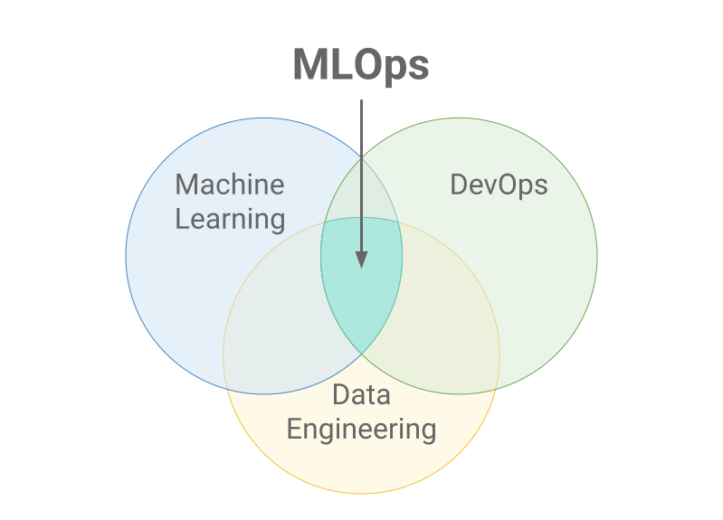

# MLOPS

## 1. Introduction

### 1.1 What is MLOps?

**MLOps** stands for `Machine Learning Operations`. It contains a set of practices that aims to deploy and 
maintain machine learning models in production reliably and efficiently

Machine learning models are developed, trained and tested in isolated experimental systems. When a model is ready to 
be deployed in a production environment, we need a standard operation procedure that can deploy the model efficiently 
and then maintaining and monitoring the model, or even retrain the model.

MLOps is a set of best practices that seeks to increase automation and improve the efficiency of models during
the whole ml lifecycle, while also focusing on business and regulatory requirements.  
 
MLOps applies to the entire lifecycle - from integrating with model code development ( 
continuous integration/continuous delivery), orchestration, and deployment, to health, diagnostics, governance, 
and business metrics. 

### 1.2 Why do we need MLOps?

Put a machine learning model into production is difficult. It envoles many complex components such as 
- data collection/ingest, 
- data prep (e.g. cleaning, feature engineering, etc), 
- model development
- model training, 
- model tuning
- model deployment
- model monitoring, 
- model explainability
- ETC. 

Below figure shows the mlops competence requirement:

These components require the collaboration and hand-offs across teams, from Data Engineering to Data Science to ML Engineering. 
Naturally, it requires stringent operational rigor to keep all these processes synchronous and working in tandem. 
MLOps encompasses the experimentation, iteration, and continuous improvement of the machine learning lifecycle. 

By adopting an MLOps approach, data scientists and machine learning engineers can collaborate and `increase the pace 
of model development and production`, by implementing continuous integration and deployment (CI/CD) practices with 
proper monitoring, validation, and governance of ML models.

### 1.3 What are the benefits of MLOps?

The primary benefits of MLOps are 
- efficiency: MLOps allows data teams to achieve faster model development, deliver higher quality ML models, and 
               faster deployment and production
- scalability: MLOps also enables vast scalability and management where thousands of models can be overseen, controlled, 
               managed, and monitored for continuous integration, continuous delivery, and continuous deployment. 
                Specifically, MLOps provides reproducibility of ML pipelines, enabling more tightly-coupled 
              collaboration across data teams, reducing conflict with devops and IT, and accelerating release velocity
- risk reduction: Machine learning models often need regulatory scrutiny and drift-check, and MLOps enables greater 
               transparency and faster response to such requests and ensures greater compliance with an organization’s 
               or industry’s policies.

## 2. Key steps in MLOps

The complete MLOps process includes three broad phases of 
1. Designing the ML-powered application
2. ML Experimentation and Development
3. ML Operations

### 2.1 Designing the ML-powered application

The first phase is devoted to business understanding, data understanding and designing the ML-powered software. 
In this stage, we identify our potential user and use case, design the machine learning solution to solve its problem, 
and assess the further development of the project. Mostly, we would act within two categories of problems:
- increasing the productivity of the user
- increasing the interactivity of our application.

Initially, we define ML use-cases and prioritize them. The best practice for ML projects is to work on one ML use case 
at a time. Furthermore, the design phase aims to inspect the available data that will be needed to train our model and 
to specify the functional and non-functional requirements of our ML model. We should use these requirements to design 
the architecture of the ML-application, establish the serving strategy, and create a test suite for the future ML model.

### 2.2 ML Experimentation and Development

The second phase is devoted to verifying the applicability of ML for our problem by implementing Proof-of-Concept for 
ML Model. Here, we run iteratively below steps:
1. Exploratory data analysis (EDA)
2. identifying or polishing the suitable ML algorithm for our problem, 
3. data engineering (e.g. data cleaning, feature engineering)
4. model engineering (e.g. model training and tuning). 

The primary goal in this phase is to deliver a stable quality ML model that we will run in production.

### 2.3 ML Operations

The third phase is devoted to deliver the previously developed ML model into production. Here, we need to address 
following MLOps principals:
- Model tracking: track all the necessary element to reproduce the model such as code, hyperparameter and training data.
- Model Governance : manage model versions, model artifacts and transitions through their lifecycle (e.g. ). Discover, share, and collaborate across ML models with the help of an open source MLOps platform such as MLflow.
- Model inference and serving
- Model monitoring
- Automated model retraining

